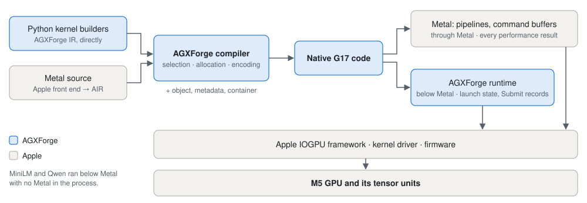
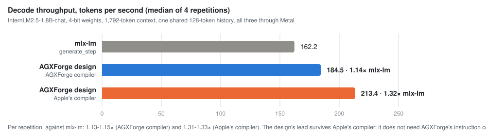
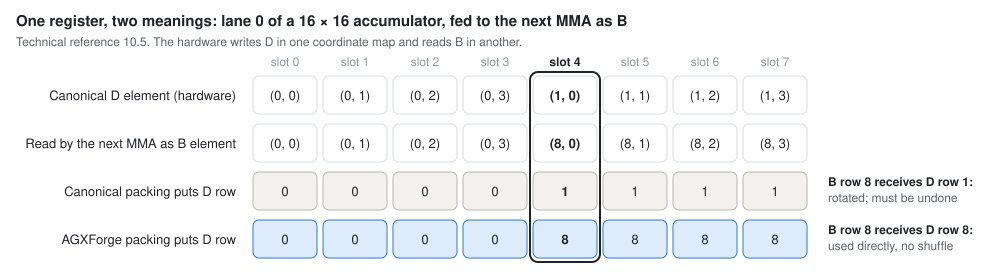

# AGXForge

**A native compiler and runtime for the Apple M5 GPU (G17) and the tensor units in its cores, built on a machine
model recovered and checked by measurement.** AGXForge compiles its own IR to G17 machine code: instruction
selection, register allocation, encoder, and the object, metadata and container the Metal path loads. The same code
runs **through Metal** and **below Metal**, where its own runtime writes the launch state and submits through
Apple's private IOGPU interface. All measurements are from **one M5 Pro (H17s, 48 GB)**.

<picture>
  <source media="(prefers-color-scheme: dark)" srcset="docs/figures/execution-paths-dark.svg">
  
</picture>

> **Status.** A curated, archival release of a research checkout, not maintained. Issues are open for questions
> and corrections; code contributions are not being solicited.
> [RELEASE.md](RELEASE.md) says what was kept, what was left out and why.

| | |
|---|---|
| **Read** | [the technical reference](docs/g17-technical-reference.pdf) (PDF, 191 pages; [LaTeX source](docs/tex/)), [the demonstrations](docs/demonstrations.md), [the evidence record](docs/g17-tensorops-machine-model.md) |
| **Run** | [four example workflows](examples/README.md): compile a tensor product, check a tensor rule against hardware evidence, inspect the decode study, inspect native inference |
| **Inspect** | [the implementation map](#the-implementation), [what this release contains](RELEASE.md), [provenance of every file](PROVENANCE.md), [RELEASE-MANIFEST.json](RELEASE-MANIFEST.json) |

## Below Metal: a complete model, with no Metal in the process

Qwen2.5-0.5B-Instruct answered *"Hello! How can I assist you today?"*, with every model operation running as
AGXForge-compiled code launched by AGXForge's runtime
([receipt](evidence/g17-native-qwen-guarded-generation.json)). Correctness is checked against the original
checkpoint in FP64, independently of the generated text: **37 of 37 logit vectors** lie within
`0.05 + 0.003·|reference|` and agree on the top token, under bounds fixed before dispatch
([check](evidence/g17-native-qwen-generation-independent-check.json)). MiniLM-L6 ranks a paraphrase of its query
(cosine 0.615) above an unrelated sentence (0.171), checked the same way
([receipt](evidence/g17-native-encoder-guarded-retrieval.json)).

Native execution is slower than matched Metal and about 7-15x slower than Transformers on MPS, and it was
measured on macOS 26.6.2 (25G83) only. Apple still supplies the IOGPU framework, the kernel driver and the
firmware; [the demonstrations, 1](docs/demonstrations.md#1-complete-models-below-metal) gives the full scope.

## Through Metal: a decode design that beats mlx-lm at 1,792 tokens

InternLM2.5-1.8B-chat, 4-bit, a 1,792-token context: **mlx-lm 162.2 tok/s, AGXForge's design 184.5 (1.14x), the
same design compiled by Apple 213.4 (1.32x)**. The design is a parallel attention reduction, fused projections and
residuals, and seven dispatches per layer against mlx-lm's sixteen. Apple's compiler produces bit-identical output
from it and runs that faster, so the lead is not AGXForge's instruction control.

<picture>
  <source media="(prefers-color-scheme: dark)" srcset="docs/figures/decode-throughput-dark.svg">
  
</picture>

The study covers one model at one context and runs on a shared history rather than free generation; at a
196-token context AGXForge falls slightly below mlx-lm (0.91-1.02x, MM 25.211).
[Workflow 3](examples/README.md#3-the-matched-decode-study) re-derives these numbers from the
[receipt](evidence/g17-matched-study-v1/decode-shared-history.json), and
[the demonstrations, 2](docs/demonstrations.md#2-a-decode-design-that-survives-a-compiler-swap) sets out the
comparison in full.

## A tensor finding: one register, two meanings

A tensor MMA leaves its 16 x 16 result spread over 32 lanes, eight registers each. Fed to the next MMA as its B
operand, the same registers are read under a different coordinate map: **in lane 0, slot 4 holds D element (1, 0)
but is read as B element (8, 0)**. Apple-compiled `simdgroup_matrix` code packs D canonically, so a register-fed B
arrives row-rotated and must be corrected; AGXForge packs the producer so D row 8 sits where B row 8 is read, and
the chained product needs no shuffle.

<picture>
  <source media="(prefers-color-scheme: dark)" srcset="docs/figures/feed-packing-dark.svg">
  
</picture>

The preregistered reference applied the rotation, and the recorded GPU output matches the unrotated product on
all 1,024 elements while the rotated reading misses every one. The domain is one 32 x 32 stage and one SIMD
group, and the result says nothing about timing.
[Workflow 2](examples/README.md#2-a-tensor-rule-against-hardware-evidence) recomputes both readings on the CPU, and
[the demonstrations, 3](docs/demonstrations.md#3-what-the-tensor-unit-does-measured) adds int8 saturation per
16-product issue and a silent hazard in Apple's cooperative-tensor chaining. No int8 GEMM speed advantage is claimed
([MM 25.212](docs/g17-tensorops-machine-model.md#25212-apples-public-int8-gemm-mpp-matmul2d-is-exact-at-25161s-four-shapes-and-its-tuned-medians-396-1556-us-are-below-this-projects-historical-int8-medians-not-a-paired-study-2026-10-04)).

## The implementation

| Part | Where | Notes |
|---|---|---|
| IR and builder | [`agxforge/g17/ir.py`](agxforge/g17/ir.py) | typed SSA; tensor operations are first-class |
| Compiler | [`agxforge/g17/cc.py`](agxforge/g17/cc.py), [`tlower.py`](agxforge/g17/tlower.py), [`indexgen.py`](agxforge/g17/indexgen.py), [`mmaenc.py`](agxforge/g17/mmaenc.py), [`encode.py`](agxforge/g17/encode.py) | selection, allocation, scoreboard waits, tensor lowering, encoders |
| Executor contract | [`agxforge/g17/abi.py`](agxforge/g17/abi.py) | what an executor must provide; `program.abi()` |
| Image author (Metal path) | [`agxforge/g17/scanlink.py`](agxforge/g17/scanlink.py), [`mdgen.py`](agxforge/g17/mdgen.py), [`authorobj.py`](agxforge/g17/authorobj.py), [`machobj.py`](agxforge/g17/machobj.py) | object, `__GPU_METADATA`, library and binary archive |
| Decode and prefill kernels | [`agxforge/kernels/`](agxforge/kernels/__init__.py): [`qmv.py`](agxforge/kernels/qmv.py), [`attention.py`](agxforge/kernels/attention.py), [`norm.py`](agxforge/kernels/norm.py), [`argmax.py`](agxforge/kernels/argmax.py), [`prefill_mma.py`](agxforge/kernels/prefill_mma.py), [`numerics.py`](agxforge/kernels/numerics.py) | each kernel's layout, IR builder and numerical reference (bit-exact, or an enclosure for the hardware-exp2 forms) |
| Model graph (Metal path) | [`agxforge/inference/`](agxforge/inference/__init__.py): [`catalog.py`](agxforge/inference/catalog.py), [`assemble.py`](agxforge/inference/assemble.py), [`prefill.py`](agxforge/inference/prefill.py), [`execute.py`](agxforge/inference/execute.py) | model config to tokens: kernel forms, graph assembly, execution |
| Metal executor | [`tools/g17decodegen.m`](tools/g17decodegen.m), [`tools/g17twinrun.m`](tools/g17twinrun.m), [`tools/g17bundlerun.m`](tools/g17bundlerun.m) | one command buffer per token; the matched-study harness and the bundle runner |
| Native runtime (below Metal) | [`spike/agxsub/g17pure3_preflight.c`](spike/agxsub/g17pure3_preflight.c), [`tools/g17inferencesession.py`](tools/g17inferencesession.py), [`agxforge/g17/runtime.py`](agxforge/g17/runtime.py) | resources, launch state, IOGPU Submit records (layouts measured on 25G83) |
| Model pipeline | [`tools/g17inferencelower.py`](tools/g17inferencelower.py), [`g17inferenceprepare.py`](tools/g17inferenceprepare.py), [`g17inferencebundle.py`](tools/g17inferencebundle.py), [`g17nativegenerate.py`](tools/g17nativegenerate.py) | import, lowering, planning, bundling, generation |
| Decoder interface | [`agxforge/g17/model.py`](agxforge/g17/model.py), [`tools/agx3dis.c`](tools/agx3dis.c) | Apple's G17 decoder, loaded from `GPUCompiler.framework` |
| CPU emulator | [`tools/g17emu.py`](tools/g17emu.py) | runs a program from its bytes; needs Apple's decoder, so macOS only |
| ISA tables | [`isa/`](isa/) | the recovered forms, operand maps and contracts the compiler reads |

## Requirements

Building needs macOS on Apple silicon with Xcode, Python 3 (tested with 3.14.7) and
`pip install -r requirements.txt`; running anything on the GPU needs an M5-family GPU (G17). Even compiling needs
macOS, because the release checks decode every program with Apple's G17 decoder from `GPUCompiler.framework`.
Workflows that reproduce measurements need more than this ([examples/README.md](examples/README.md)).

```
make platform            # how this machine differs from the measured one (macOS 26.6.2, M5 Pro)
make native-tools        # the decoder wrapper and the native harnesses
make examples            # workflows 1-4: compile, simulate, and two receipt checks - no GPU dispatch
make test                # the retained tests - no GPU dispatch
```

The native path's launch layouts were measured on **macOS 26.6.2 (25G83)** only, and the path has not been
dispatched on another build; [RELEASE.md](RELEASE.md) says what has and has not been reproduced.
[PROVENANCE.md](PROVENANCE.md) identifies every file's origin, including the retained Apple-compiled witness objects
some tensor-lowering paths read, and [docs/execution-validation.md](docs/execution-validation.md) states the
dispatch rules.

**How it was made.** [Claude Code](https://claude.com/product/claude-code), Anthropic's coding agent, was used
throughout the project to help reverse-engineer the M5 GPU and its instruction set, and to document them.

**License.** MIT for this project's own code and writing ([LICENSE](LICENSE)). The model metadata keeps its upstream
Apache-2.0 license ([THIRD-PARTY-NOTICES.md](THIRD-PARTY-NOTICES.md)). Where the evidence record links to research
files this release does not carry, the link leads to [docs/OMITTED.md](docs/OMITTED.md).
